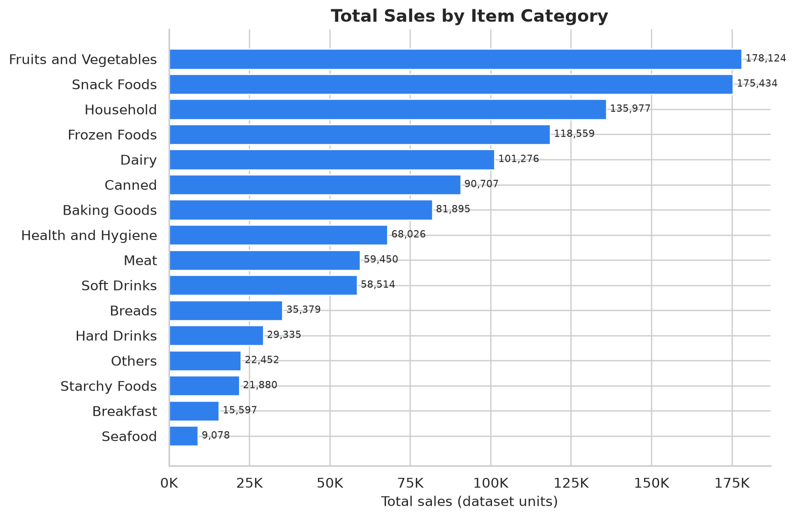
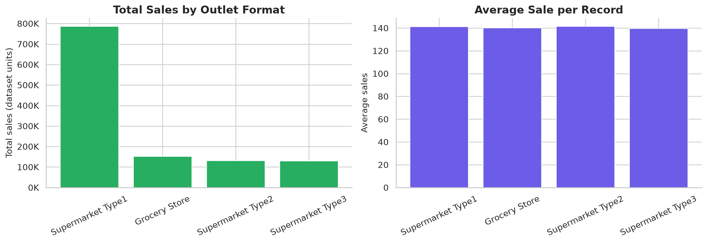
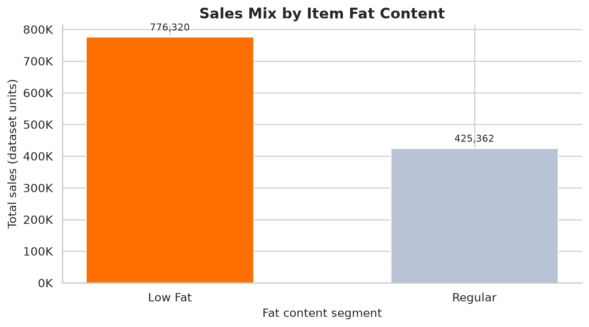

# Blinkit Retail Sales Analysis

A portfolio-ready **Python and Jupyter Notebook case study** that analyses item-level retail sales across product categories, fat-content segments, outlet formats, location tiers, outlet sizes, and establishment-year cohorts.

> **Portfolio focus:** data cleaning, label standardisation, KPI calculation, grouped analysis, comparative visualisation, and business-oriented storytelling.

## Business objective

Retail teams need to understand which product categories and outlet formats contribute most to observed sales. This project converts a raw item-outlet extract into a reproducible analytical workflow that answers practical questions about category mix, outlet performance, location patterns, and data quality.

## What is included

| Artifact | Purpose |
|---|---|
| `blinkit-retail-sales-analysis.ipynb` | Clean, executed notebook with professional headings, KPIs, charts, and insights |
| `blinkit_data.csv` | Source item-outlet sales extract |
| `images/` | High-resolution chart exports for portfolio and README use |
| `resume-project-description.md` | Resume-ready project summary, bullets, and interview talking points |
| `scripts/validate_data.py` | Data-quality validation checks |
| `blinkit-sales-analysis.ipynb` | Original notebook retained for reference |
| `Blinkit Analysis.pptx` | Original supplementary presentation |

## Verified dataset profile

The source extract contains **8,523 records**, **12 columns**, **zero duplicate rows**, and **1,463 missing cells**, all attributable to missing item-weight values. After standardising inconsistent fat-content labels such as `LF`, `reg`, and `low fat`, the notebook calculates total sales of **1,201,681.48 dataset units** and an average rating of **3.97 / 5**.

| Metric | Result |
|---|---:|
| Records | 8,523 |
| Columns | 12 |
| Duplicate rows | 0 |
| Missing cells | 1,463 |
| Missing item weights | 1,463 |
| Negative sales records | 0 |
| Total sales | 1,201,681.48 |
| Average sale per record | 140.99 |
| Average rating | 3.97 / 5 |

## Analysis and visual showcase

### 1. Sales by item category

The horizontal ranking chart identifies **Fruits and Vegetables** as the leading category in observed sales, followed by Snack Foods and Household. Horizontal bars and end labels make the comparison easy to scan.



### 2. Outlet-format performance

The two-panel comparison separates **total sales** from **average sale per record**, preventing outlet scale from being confused with normalised performance.



### 3. Product mix by fat content

The cleaned fat-content comparison shows how observed sales are distributed between Regular and Low Fat products.



### 4. Outlet location and cohort analysis

Additional visuals compare fat-content mix by location tier, sales by outlet establishment year, sales by outlet size, and sales by location tier.

| Visual | File |
|---|---|
| Location tier and fat-content mix | `images/tier_fat_content_mix.png` |
| Sales by establishment year | `images/sales_by_establishment_year.png` |
| Sales by outlet size and location tier | `images/outlet_size_and_tier.png` |
| Item visibility vs. sales | `images/visibility_vs_sales.png` |

## Key business insights

The analysis finds that Fruits and Vegetables is the highest-sales item category in this extract, while Supermarket Type1 is the highest-sales outlet format. Regular and Low Fat sales can be compared consistently only after label standardisation. Location tiers and outlet sizes provide useful context for sales concentration, while the visibility chart is descriptive and should not be interpreted as evidence of causality.

The data-quality review is also a key finding: 1,463 item-weight values are missing. Any weight-based analysis should explicitly document whether those records are excluded or imputed.

## Analytical workflow

1. Load the CSV and standardise column names.
2. Profile shape, data types, duplicates, missing values, and numeric ranges.
3. Harmonise inconsistent fat-content labels.
4. Calculate headline KPIs for sales, ratings, and record counts.
5. Compare sales by item category and fat-content segment.
6. Compare outlet formats using total and average sales.
7. Analyse location tier, outlet size, and establishment-year cohorts.
8. Explore item visibility versus record-level sales.
9. Generate business insights and document limitations.
10. Save portfolio-ready PNG charts under `images/`.

## How to reproduce

```bash
git clone https://github.com/Corvus06655/blinkit-sales-analysis.git
cd blinkit-sales-analysis
python -m venv .venv

# Windows
.venv\\Scripts\\activate

# macOS/Linux
source .venv/bin/activate

pip install -r requirements.txt
python scripts/validate_data.py
```

Open `blinkit-retail-sales-analysis.ipynb` in Jupyter and run the cells from top to bottom.

## Limitations

This repository contains an educational item-outlet sales extract, not a live Blinkit internal reporting feed. It does not establish profitability, delivery performance, customer retention, or causal drivers of sales. Outlet establishment year is treated as a cohort dimension rather than a daily or monthly time series. Missing item-weight values are retained and reported rather than silently imputed.

## Author

**Mayank Srivastava**  \
[GitHub](https://github.com/Corvus06655) · [LinkedIn](https://linkedin.com/in/mayank-srivastava-076020215)
