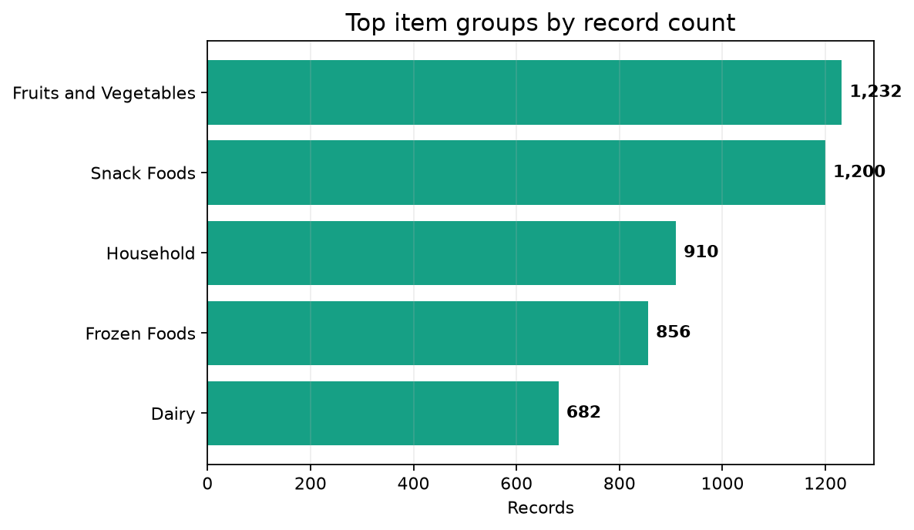

# Blinkit Sales Analysis

A Python retail analysis of **8,523 product-outlet records** designed to understand item performance, outlet formats, location tiers, and data-quality considerations in a quick-commerce style dataset.

> **Portfolio focus:** data cleaning, category analysis, outlet comparison, retail KPIs, and business interpretation.

## Business objective

Retail operators need to understand which products and outlet formats contribute to sales so they can improve assortment, replenishment, and store-level decisions. This project provides a descriptive view of product and outlet performance.

## Dataset and quality

The source dataset contains 8,523 rows and 12 columns with zero duplicate rows. There are 1,463 missing Item Weight values, and the first field contains a byte-order-mark artifact that the notebook standardizes before analysis. Fruits and Vegetables and Snack Foods are the largest item groups by record count. Supermarket Type1 is the dominant outlet format, and Tier 3 is the most represented location tier.

## Visual evidence

## Analytical workflow

The notebook inspects encoding artifacts, field names, missing values, duplicates, and categorical inconsistencies; standardizes category labels; compares item groups, outlet formats, location tiers, and outlet sizes; reviews sales and rating distributions; and translates observed patterns into assortment, replenishment, and outlet-review questions.

## Business interpretation

The analysis is descriptive and does not establish that a category or outlet format causes higher sales. Retail decisions should compare sales with exposure, outlet age, assortment, margin, stock availability, and operating period. Missing item weights should be handled explicitly rather than silently imputed.

## Business recommendations

Combine product sales with stock availability and margin before changing assortment decisions. Compare outlets using sales per item or sales per operating year to avoid confusing outlet size with productivity. Track missing weights as a data-quality issue and validate the field before using it in operational models. Extend the project with outlet-level KPI definitions, cohort comparisons by establishment year, and an out-of-sample sales baseline.

## Tools and repository contents

Python · Pandas · NumPy · Matplotlib · Jupyter Notebook · PowerPoint

The repository contains blinkit_data.csv, blinkit-sales-analysis.ipynb, Blinkit Analysis.pptx, and the verified chart preview at images/blinkit_top_item_groups.png.

## Run locally

Clone the repository, install pandas, numpy, matplotlib, and jupyter, and open blinkit-sales-analysis.ipynb in Jupyter Notebook.

## Limitations and next steps

This is a descriptive retail analysis, not a demand-forecasting model. A stronger version would define sales-per-outlet KPIs, compare outlets after controlling for establishment year and size, build a seasonal baseline, and report forecast error on a time-based holdout.

---

*Part of Mayank Srivastava's Data Analyst portfolio.*
